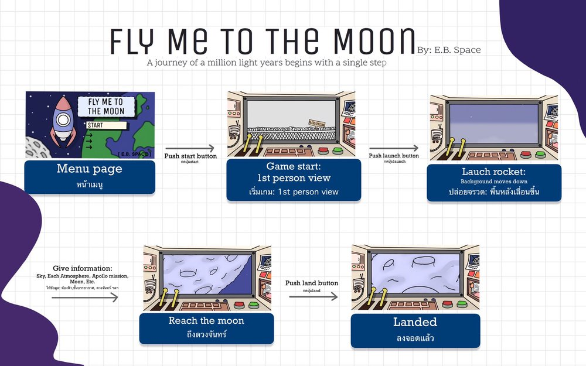
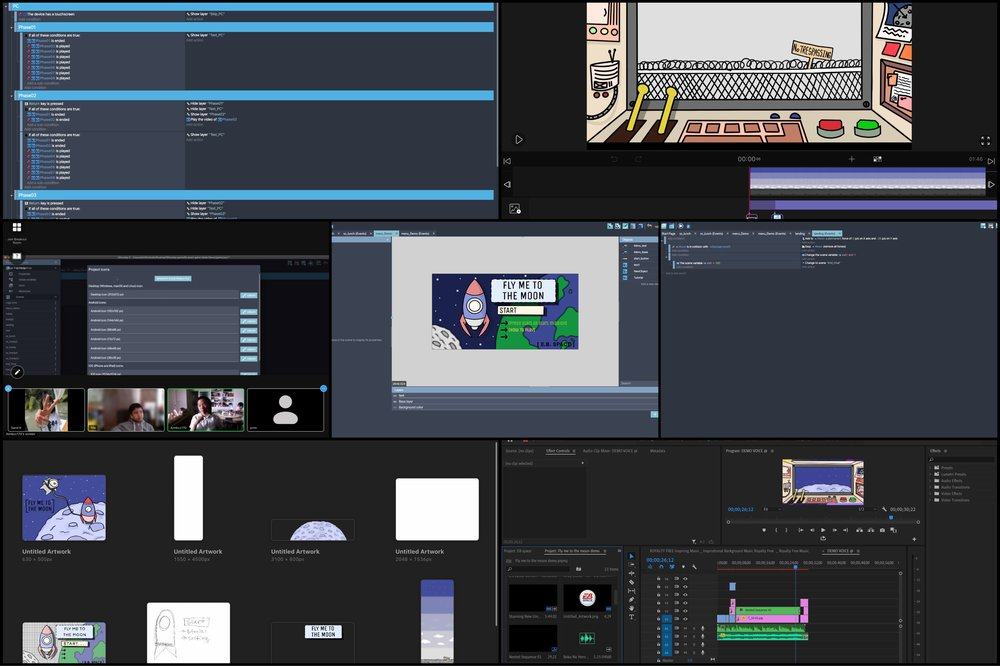
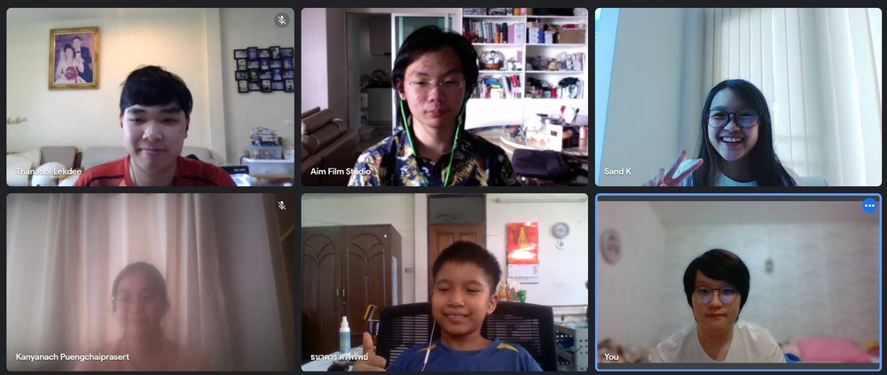

# Fly Me To The Moon

## High-Level Project Summary

‘Fly Me To The Moon’ is a video game simulation of a simplified journey to the moon. With the incoming NASA's near-term space exploration plans of returning to the Moon and plans of landing a crew on Mars, it is necessary to inform and educate the public about these important endeavors. In response to that, one of the main educational purposes of our game is to experience being in outer space from the perspective of an astronaut.

## Link to Final Project and Demo

* [Itch.io](https://aimbcc170.itch.io/fly-me-to-the-moon)
* [Youtube](https://youtu.be/TRXx-ms6pMQ)

## Detailed Project Description

### What is ‘FLY ME TO THE MOON’? 

‘Fly Me To The Moon’ is a video game simulation of a simplified journey to the moon. The simulation guides the user through each atmosphere layer to the moon. Information and facts files are also added throughout the simulation to educate the users about the atmosphere layers as well as the moon, and the Artemis mission. The graphics and visuals of the game have been created by one of our team members simplifying and making the journey to the moon as easy to understand as possible for users of all age groups; for example, the control panel, the shape of the rocket, and the fact files have been simplified to reduce unnecessary details and focus on the main, overall process of the journey to the moon. A balanced amount of details, however, still should be included as our idea of the simulation is to make the user’s game experience as realistic as possible by including details without going off the point. One of the main educational purposes of the game is to experience being in outer space from the perspective of an astronaut. With the limited time, we've only managed to make our video game accessible through two platforms: Window and macOS. The game can be played on the link and can directly be downloaded into your device, however we suggest you to download the game as you might experience some interruption and delays when playing on the website

### How it work?

The simulation begins as the user presses the start button on the menu page, then the user is redirected to the first-person view from inside the spaceship; the point of view of an astronaut. There are two main buttons: the start button and the green button. The green button can be counted as the most important button in the game, being responsible in the process of both launching and landing the spaceship. After the user has finished transitioning to the astronaut’s point of view, the user is required to press the green button to take off. The rocket will, then, launch and one of our E.B. astronauts (aka Helper) will guide the user through each layer of the earth’s atmosphere, providing interesting facts on each layer. After reaching the final layer the user will start to see the moon. After that, pressing the land (green) button is required. After the ‘land’ button is pressed, the user’s journey to the moon with ‘Fly Me To The Moon’ will then ,sadly, have to end. The event flowchart can be seen below:

### What we hope to achieve:

Our purpose and goals of this game is to encourage, support, and inspire dreams. We hope to provide a great platform for people from all around the world to explore and find out more about what they are interested in. Moreover, we hope to educate people and make space-related information a common knowledge. We, E.B. Space, wish to provide opportunities for everyone to know more about the fascinating outer space. 

### TOOLS, CODING LANGUAGE, AND SOFTWARE WE USED:

During the process of creating ‘Fly Me To The Moon’, we use a combination of different software. Procreate is used in most of the designing process, being used to create every sprite, background, and other objects. Adobe Premier Pro is used to edit our introduction video (needed locally) and our demo. The animation in the game during the launch of the rocket is done through VLLO, a video editing application. GDevelop 5 is one of the main software used in this project as it was used to create the game. We developed ‘Fly Me To The Moon’ using programming blocks within the software to create certain algorithms and assemble them into a game. itch.io is a platform we displayed our game onto. Other online websites are also used; for instance, Google platforms, Zoom, etc.

## Space Agency Data

There is a lot of NASA space agency data available to support us. E.B. Space did some research on these data and highlight the parts that maybe useful for our project: 

Click [HERE](https://drive.google.com/drive/folders/1-PQ41fPlTghjy1SZZf7rB7RLyA-1QdSa) to view full annotations

Nasa's plan is to make the Human landing system possible ( HLS ). We, E.B. Space, found that really interesting and took it as an idea for our work. We, therefore, focus our video game on an astronaut's experience and perspective while traveling to the moon. From our discussion, the next thing we could do to improve our game is to be able to make our spaceship access any part of the moon and make a simulation of the journey to Mars. 

## Hackathon Journey

### What inspired us to choose this challenge?:

'A journey of a million light years begin with a single step'. As we take our first step, we would like to lend a hand to others for their first step too.
						
E.B. Space wanted to be a part of creating a platform of opportunities. Opportunities for everyone to learn about what they are interested in, opportunities for them to enjoy themselves, and opportunities for them to follow their dreams.

### Our approach to developing ‘Space Tracker’:

After creating the team and gathering members, we started off by choosing the challenge based on our interests and strengths. We then started brainstorming and creating plans and pictures of the completed product. Next, we delegated tasks, having set deadlines for each one. We had a short meeting every 2 days to check on the progress in the preparation for the day of the hackathon. On the day of the hackathon, after each task was finished, we took turns in checking and editing each other’s work. After making sure each section is completed to the satisfaction of the team, we combined them together, creating one big project. Then we tested the product and each gave feedback on how to improve it. Having created the presentation, now we can play amongst the stars as we take our first step on our journey to the moon.

### Problems we encountered and how we resolved them:

During the preparation and especially during the hackathon, we encountered many problems. The first, and most annoying problem we faced was technical difficulties. One of our member’s computers decides to randomly update itself, causing it to shut down during our introduction video editing. We tried to get our video file back but we couldn’t, so we had to re-edit the whole video again. The other problem we ran into was time-synchronization between team members. This is because we are all from different schools and our schedules are different, therefore we had to find the right time for everyone to meet. We resolved this problem by hosting a short meeting every 2 days to check and assign responsibilities. Having such limited time was so pressuring as well. We found out about this hackathon quite late so we had to work more efficiently to outweigh the time we lost. Additionally, we are all Thai first language speakers, working with English is, undeniably, one of our biggest challenges. We, therefore, have to check and edit each other’s work as we go along to make sure that the language used is suitable for the topic and look out for grammatical errors.

### Overall experience:

In the NASA Space Apps Challenge, our first-ever hackathon, our experience can be described as one word: CHAOTIC! It was very chaotic having to work everything out by ourselves, delegating jobs, completing tasks, making sure everyone is on the same page, keeping track of the timeline, etc. However, it, surprisingly, was such a wonderful experience. There was a lot of arguing, agreeing, and adjusting going on. We each developed so many skills from this hackathon, such as teamwork, communication, leadership, organization, problem-solving, and so many more. After all, we would like to say a very big thank you to everyone involved in making this great event happen, our parents for the support, and our robotics teacher; he was the one who introduced the Space Apps Challenge to us. Without him, our team would never have come together, decided to enter this hackathon, and would have missed all these valuable experiences. 

### 3 Words for the Space Apps experience from each of our team members:

* Aim: Suffering, Enjoyable, Chaotic
* Austin: Memorable, interesting, Difficult
* Fifa: Proud, Fun, Confusing
* Nemo: Wild, Unpredictable, Uncharted
* Prim: Sleep-deprived, teamwork, Educational
* Sand: Exciting, Pressured, Memorable

## More about us and our project:
note: This is not a demo

* Our [YouTube Channel](https://www.youtube.com/channel/UC3hS9z0mG1Q7qKxdE9_2KmA)
* Fly Me To The Moon [slide presentation](https://docs.google.com/presentation/d/118XW3yObcUERokhKPUIqrYx5JUJeVSEeTpsxrHNFYkM/present?slide=id.g4dc676206e_0_1218)
* Fly Me To The Moon [game explanation](https://www.youtube.com/watch?v=X1jyowRu4DI)
* E.B. Space members [Introduction video](https://www.youtube.com/watch?v=W3d933Gc3E0)

## References
Data from NASA Links: 
* https://www.nasa.gov/sites/default/files/atoms/files/artemis_plan-20200921.pdf
* https://www.nasa.gov/exploration/systems/sls/index.html

Other Tools & Software:
* sound effect: [Zapsplat](https://www.zapsplat.com)
* Font: [Unica one](https://fonts.google.com/specimen/Unica+One)
* Editing: [VLLO](https://play.google.com/store/apps/details?id=com.darinsoft.vimo&hl=en&gl=US), [Adobe Premier Pro](https://www.adobe.com/th_en/products/premiere.html)
* Graphic making: [Procreate](https://apps.apple.com/us/app/procreate/id425073498)
* Game making: [GDevelop 5](https://gdevelop-app.com/)
* Platform: [itch.io](https://itch.io/)
